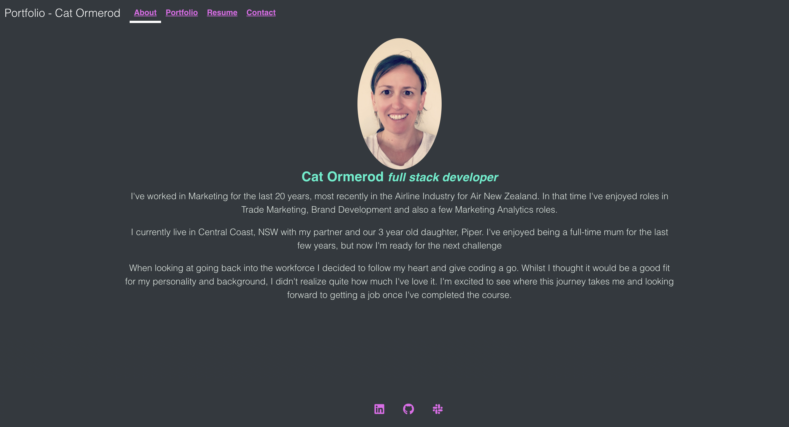
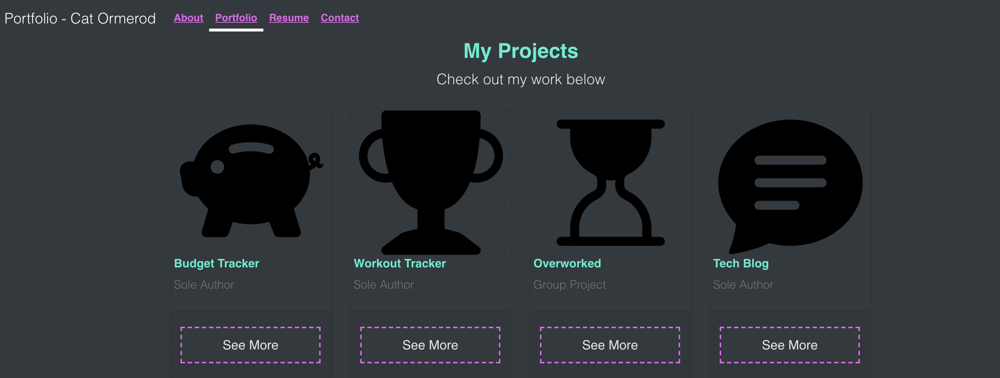

# portfolio-react
An updated portfolio utilising the most recently learned tools and technologies, most importantly, React.

## Description & LIVE DEPLOYED WEBSITE
---
The app can be viewed live [here](https://catormerod.github.io/portfolio-react/).  For more information see below. 

This portfolio was a definite journey!  I started off using pages and use state to control the page change but found issues with integrating the nav link active status with reactstrap in this manner.  So I switched over to React-Router-Dom and found that that worked nicely and was quite easy to implement.  However, I then found I couldn't link directly into pages the way I wanted.  After consulting with some other students I found that this could be achieved through hashrouter.  

I then continued through my journey adding other libraries.  I found a lot of the libraries had documentation that was difficult to follow so went through a few of them before I found ones I liked!  

So here is the current result!  I'm open to new library recommendations to play around with - so fire me an email (contact details below!)

## Screenshots
---
The following images show the web application's appearance and functionality: 
The homepage, which defaults to About me!

The Projects page, which lists all my favourite projects!

## Tools & Technologies
---
    - React
    - Reactstrap - for the main components
    - Bootstrap - for further styling
    - React-Router-Dom - For the page rendering and Navigation links
    - Availty-React-Validation for the contact form including validation

## Installation 
---
This portfolio is hosted on github pages (link below), or you can clone the repo and then `npm i` if you'd like to explore further.

## Questions?
---
If you have any questions about this project, please contact me directly on [email](mailto:catormerod@gmail.com). You can view more of my projects at [Github](https://github.com/catormerod) or this specific project at [portfolio-react](https://github.com/CatOrmerod/portfolio-react). 

The app can be viewed live [here](https://catormerod.github.io/portfolio-react/). 